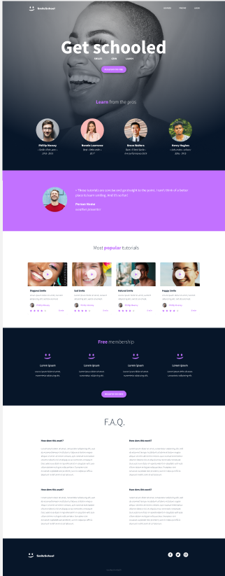

# CSS Advanced — smileSchool Landing Page

This is the CSS part of the smileSchool project. In the previous project I built
out the full HTML structure of the page, and now the focus is on styling it to
match the designer's Figma file.

The page is a landing page for "smileSchool" — an online platform for learning
how to smile better (the design's theme). It's a single long page with a few
sections: a hero, a section of tutorials, a testimonial, a membership area, and
an FAQ.

## What I'm building

The goal is to take the plain HTML I already wrote and style it so it looks like
the design below. No frameworks, no libraries — just plain HTML and CSS, written
by hand.

## Design reference

Here's the design I'm working from:

## Built with

- HTML
- CSS

No external libraries (no Bootstrap, no React, etc.) — everything is hand-coded,
which is part of the project requirements.

## What I learned / focused on

- How CSS specificity actually works and why it matters
- Adding styles with classes and selectors instead of inline styles
- The box model (margin, padding, border) and how it affects layout
- How a browser loads and renders a page

## Author

Kelly — Front-End Web Development, ALU